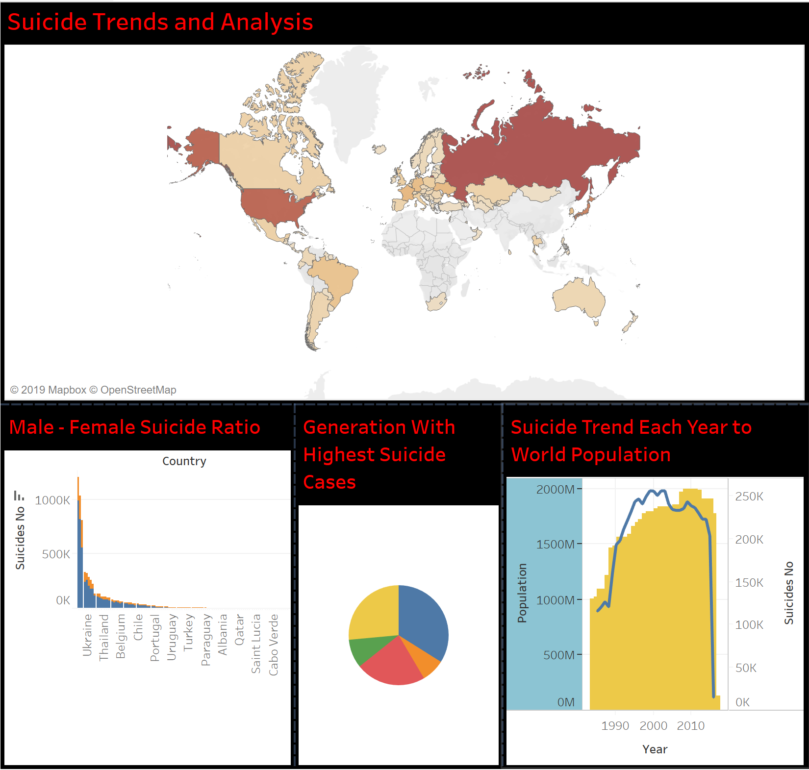

# Tableau-Project
Created visualization in tableau desktop for the academic course 515: Data visualization project.

 Created visualization and did basic analysis of suicide rate all over the world.
 

World map shows which countries have the highest suicide rate. Russia Federation and USA are the top 2 countries.
Stack bar plot shows Male to Female suicide rate and it seems that males commit more suicide than females in most of the countries.
Pie chart shows which generation affected the most with suicide, Boomers follwed by silent and then generation X suffered most all over the world.
Bar plot shows that in year 2010, number of suicide rate is the highest with respect to population as compared to other years. 
