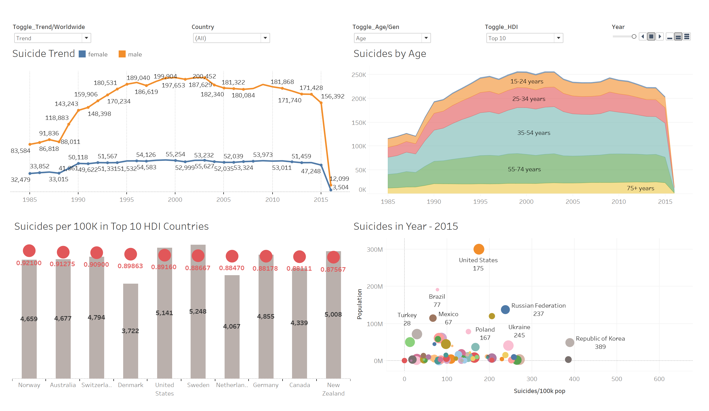
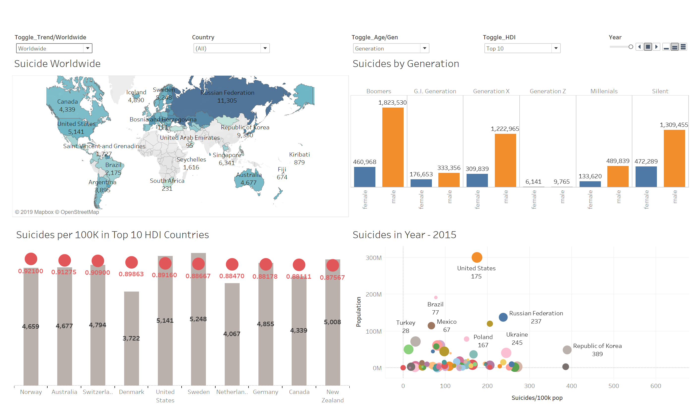

# Tableau-Project
Created visualization in tableau desktop for the academic course 515: Data visualization project.

 Created visualizations in Tableau and did basic analysis of suicide rate all over the world.
 

World map shows which countries have the highest suicide rate. Russia Federation followed by USA are the top 2 countries. The darker the color of the country, the more the suicide cases reported. You can toggle between trend or world map.

We can also check the trend of suicide by Age, generation and sex. which generation affected the most with suicide, how many males and females and of what age suffered the most

Bubble plot is an interactive visualization , we can see trend of suicides from 1985-2016.
Suicide per 100K in top 10 Human Development countries. 
